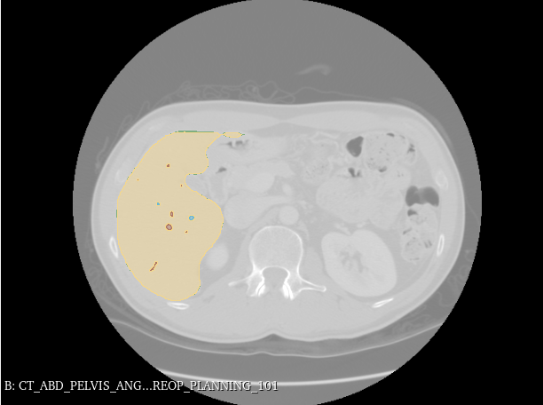
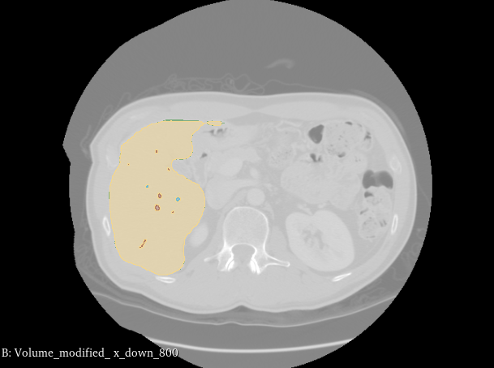
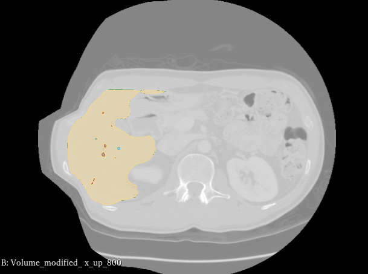
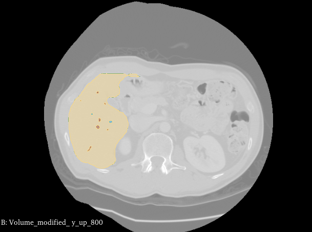

# Data Augmentation for the TCIA dataset

This repository is aimed at providing a pipeline to augment the TCIA dataset. This augmentation is made with the Slicer SOFA extension, using gravity to deform the images. 

## How it works
The main script creates a 3D model based on the segmentations of the liver / tumors / veins. Using the Slicer SOFA extension, a force (gravity) is applied to the model. The resulting transformation is retrieved and applied to the volume and the segmentation. 6 different vectors are applied to each volume / segmentations. You can change two parameters  : the magnitude of the gravity vector and the time for which the simulation is running. 


## How you should use it : 
* Download the container.
* Download the dataset using this command (inside the container).

``` sh
/opt/nbia-data-retriever/bin/nbia-data-retriever --cli /data/Colorectal-Liver-Metastases-November-2022-manifest.tcia -d ~/Downloads/TCIA
```

* You need to manually uninstall and reinstall the **Quantitave Reporting** Slicer extension. 

* Convert the DICOM database to Nifti using the **dicom2nifti.py** script. This will create a new folder with the unmodified dataset. You'll need to change the lines 4 and 5 to match your directories. You also need to change the lines 12 and 135 of the **TCIA_data_augmentation.py** to match. 


* To perform the data augmentation you'll need to run the **TCIA_data_augmentation.sh** script in your terminal. You can change the parameters (value of the magnitude / duration of simulation) at the beggining of the file. 

## Results
These are examples of how a volume and segmentations can be modified using theses scripts. I used a magnitude of 800 and a time of 10 seconds to achieve these results. 

| Image 1 | Image 2 |
|---------|---------|
|  |  |
| **Original volume and segmentation** | **Deformation with a vector going towards right** |

| Image 3 | Image 4 |
|---------|---------|
| | |
| **Deformation with a vector going towards left** | **Deformation with a vector going up** |

